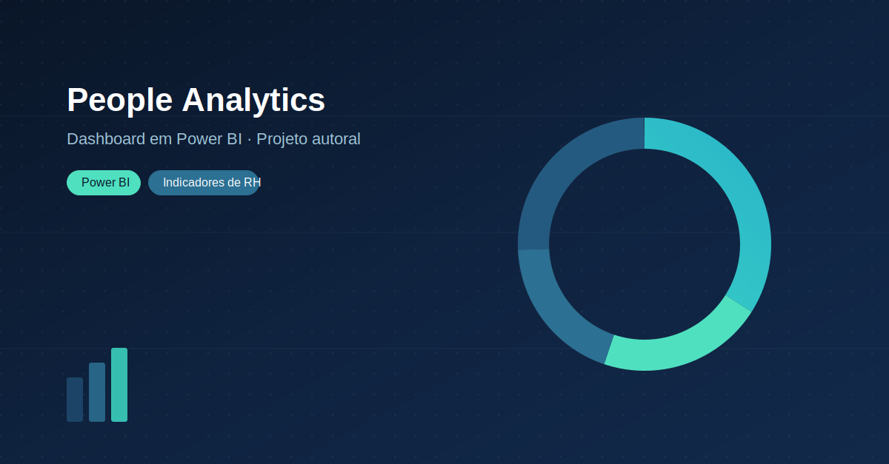
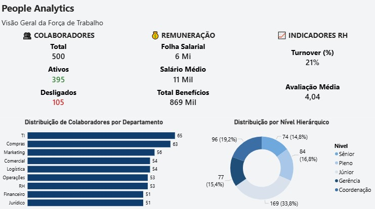
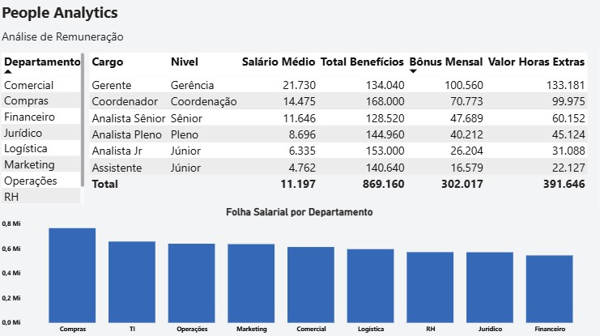
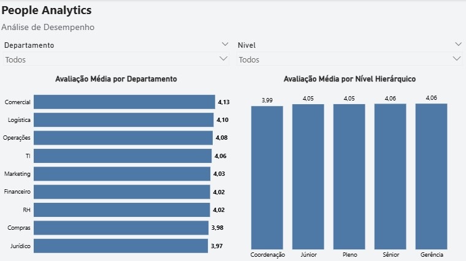

  

📊 People Analytics Dashboard

Dashboard de People Analytics desenvolvido no Power BI, com foco na análise de indicadores estratégicos de Recursos Humanos, permitindo acompanhar informações sobre colaboradores, remuneração e desempenho por meio de visualizações interativas.

📌 Sobre o Projeto

Este projeto foi desenvolvido com o objetivo de transformar dados de Recursos Humanos em informações estratégicas para apoiar a tomada de decisão.

O dashboard apresenta uma visão analítica da força de trabalho por meio de indicadores de colaboradores, remuneração e desempenho, utilizando boas práticas de modelagem de dados, DAX e visualização no Power BI.

🎯 Objetivo do Projeto

Desenvolver um dashboard de People Analytics capaz de responder perguntas de negócio relacionadas à gestão de pessoas, utilizando:

📊 Power BI
⚡ DAX (Data Analysis Expressions)
🔄 Power Query
📁 Microsoft Excel
🏗️ Modelagem Dimensional (Star Schema)
🛠️ Tecnologias Utilizadas
Power BI Desktop
DAX
Power Query
Microsoft Excel
Modelagem Dimensional (Star Schema)
📂 Estrutura do Projeto
people-analytics-powerbi/
│
├── People Analytics - Power BI.pbix
├── People_Analytics_Dataset.xlsx
├── README.md
├── LICENSE
├── capa-projeto-people-analytics.png
│
└── images/
    ├── dashboard-overview.jpg
    ├── dashboard-compensation.jpg
    └── dashboard-performance.jpg
📊 Dashboard
📄 Página 1 — Visão Geral

Objetivo

Apresentar uma visão executiva da força de trabalho da empresa.

Perguntas de Negócio
Quantos colaboradores a empresa possui?
Quantos colaboradores estão ativos e quantos foram desligados?
Qual é o valor da folha salarial?
Qual é o salário médio dos colaboradores?
Qual é o valor total gasto com benefícios?
Qual é a taxa de turnover da empresa?
Qual é a avaliação média dos colaboradores?
Como os colaboradores estão distribuídos entre os departamentos?
Como os colaboradores estão distribuídos entre os níveis hierárquicos?
💰 Página 2 — Remuneração

Objetivo

Analisar os custos relacionados aos colaboradores.

Perguntas de Negócio
Qual é a remuneração média por departamento, cargo e nível?
Quanto cada departamento recebe em benefícios, bônus e horas extras?
Qual departamento possui o maior custo com folha salarial?
📈 Página 3 — Desempenho

Objetivo

Analisar o desempenho dos colaboradores considerando diferentes perspectivas.

Perguntas de Negócio
Qual departamento apresenta a maior avaliação média?
Como a avaliação média varia entre os níveis hierárquicos?
Como o desempenho muda ao aplicar filtros por departamento e nível?
💡 Visão Analítica

O dashboard foi estruturado para responder três níveis de análise:

📊 Visão Geral

Como está a força de trabalho da empresa?

Apresenta os principais indicadores de RH, incluindo quantidade de colaboradores, turnover, folha salarial, benefícios e distribuição da força de trabalho.

💰 Remuneração

Quanto custa manter essa força de trabalho?

Permite analisar salários, benefícios, bônus e horas extras, além de identificar os departamentos com maior custo.

📈 Desempenho

Como está a performance dos colaboradores?

Analisa a avaliação média dos colaboradores por departamento e nível hierárquico, possibilitando comparações através de filtros interativos.

📁 Base de Dados

O projeto utiliza uma base de dados fictícia em Excel contendo informações de Recursos Humanos, incluindo:

Funcionários
Departamentos
Cargos
Níveis hierárquicos
Salários
Benefícios
Bônus
Horas extras
Avaliações
Datas de admissão
Datas de demissão

A base de dados está disponível neste repositório juntamente com o arquivo .pbix para fins de estudo e demonstração.

📄 Licença

Este projeto está licenciado sob a MIT License.

Consulte o arquivo LICENSE para mais informações.

# 👨‍💻 Autor

**Lucas de Oliveira Pereira**

[💼 LinkedIn](https://www.linkedin.com/in/lucasoliveira-analista/)

[🐙 GitHub](https://github.com/Oliveira93)

